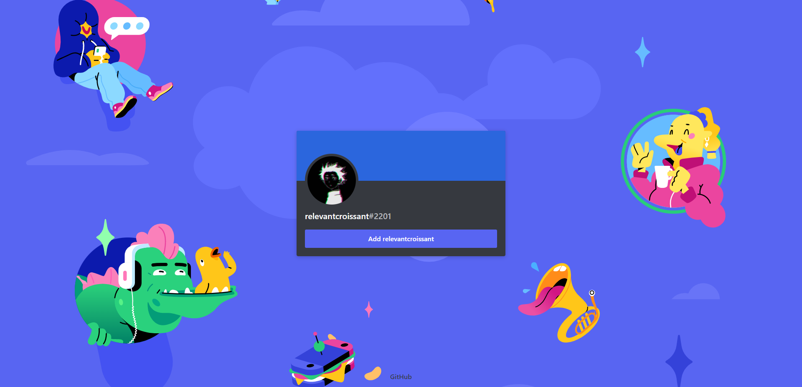

Saw [this](https://github.com/taichikuji/discordid) from [taichikuji](https://github.com/taichikuji) and felt like making my own version in NextJS and try out its API routes.

> **Disclaimer:** This project is not affiliated with, endorsed by, or associated with Discord Inc. in any way. Discord is a trademark of Discord Inc.

## Running it locally

Install the dependencies:
```bash
npm i
```

Run the server:
```bash
npm run dev
```

Open [http://localhost:3000](http://localhost:3000) in your browser to see the result.

## Example
